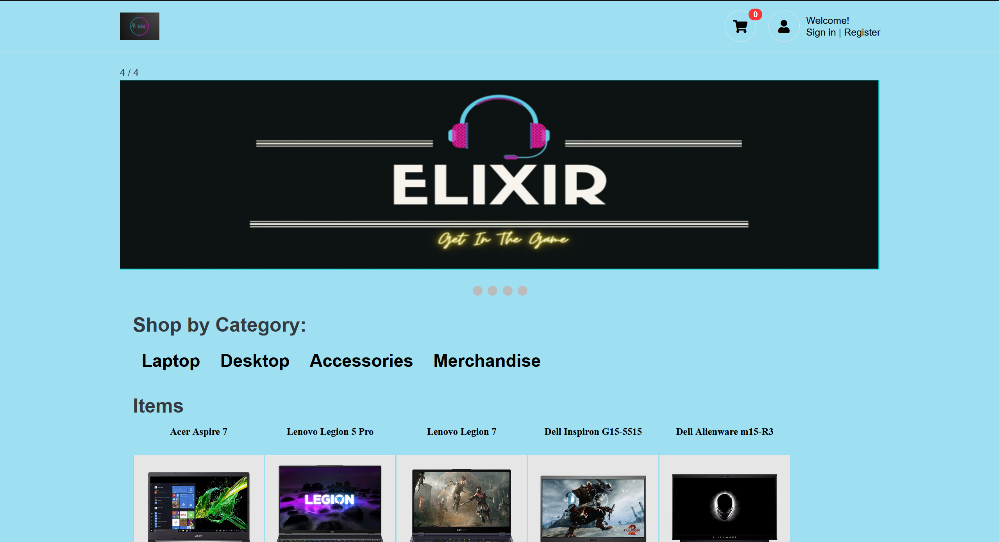

# Elixir Project

Elixir is a web application designed to provide a seamless online shopping experience for gaming merchandise and novelty items. It features a variety of products from laptops to gaming accessories, allowing users to browse, select, and purchase their favorite items online.




## Features

- User authentication and registration
- Product browsing by category
- Shopping cart functionality
- Secure checkout process

## Installation

To run the Elixir project locally, follow these steps:

### Prerequisites

- Python 3.x
- pip
- virtualenv (optional)

### Set up a Python virtual environment (optional)

```bash
python -m venv venv
source venv/bin/activate
# On Windows use
venv\Scripts\activate
```


## Install dependencies
```bash
pip install -r requirements.txt
```

## Initialize the Database
Before running the application, you'll need to create the necessary tables:
```bash
python database.py
```


Run the Application
```bash
python main.py
```
The application will be available on http://127.0.0.1:5000/ in your web browser.

## Usage
After starting the application, you can:

- Register a new user account
- Log in using existing credentials
- Browse the product catalog
- Add products to your shopping cart
- Proceed to checkout
## Contributing
Contributions to the Elixir project are welcome. Please feel free to fork the repository and submit pull requests.
